# How a receptive field is built — a walkthrough

This is a newcomer's tour of the **receptive-field (RF) mapping** pipeline: how one
session/neuron goes from raw merged data to a defined receptive field on the forearm.

A neuron here is a single microneurography unit. Every millisecond we know its
**instantaneous firing frequency (IFF)** and where on the participant's forearm it
was being touched. The receptive field is the patch of skin where touching the arm
reliably drives the neuron. The pipeline paints IFF onto a 3-D model of the forearm,
flattens that model to 2-D, and traces the outline of the responsive region.

Everything below uses one worked example, session **`2022-06-17_ST16-02` (ST16-02)**.
All figures are generated by
[`scripts/generate_rf_workflow_doc_figures.py`](../../scripts/generate_rf_workflow_doc_figures.py)
— see [Regenerating the figures](#regenerating-the-figures).

The workflow has four conceptual stages:

| Stage | What happens | Code |
|-------|--------------|------|
| 0 · Preprocessing | Merged CSV → clean per-touch contacts on the forearm; unwrap the surface to 2-D | `data/touch_population_data.py`, `surface/forearm_slim_uv.py` |
| 1 · Reduce a single touch | Each touch → a sparse per-vertex IFF map | `pipelines/rf_single_touch_pipeline.py` |
| 2 · Aggregate touches | Average all touches → one smooth heatmap on the 2-D surface | `data/rf_population_heatmap.py`, `pipelines/rf_population_response_field_pipeline.py` |
| 3 · Define the RF | Trace a boundary around the responsive region; measure it | `metrics/rf_radial_foot_boundary.py` |

---

## Stage 0 — Inputs & preprocessing

**Inputs.** Each session starts from a merged CSV (produced by the parent repo) plus a
3-D **forearm point cloud** (`<session>_forearm.ply`) in RF-centred coordinates. Two
upstream tasks clean it up: `touch_prepare_sessions` interpolates NaN gaps and assigns
block/trial/touch IDs; `touch_compute_series` adds kinematics (velocity, pressure).

**Step by step.** From the raw merged CSV to per-touch contacts on the surface:

1. **Prepare** (`touch_prepare_sessions`) — synthesise `block_order_id`, and cubic-interpolate
   NaN gaps inside each touch group → `<session>_prepared.csv`.
2. **Series transforms** (`touch_compute_series`) — derive hand velocity/acceleration,
   pressure, and MoS strain/stress per 1 kHz row → `<session>_series_augmented.csv`
   (this is where every touch *attribute* below comes from).
3. **Read & validate** — `load_population_data`
   ([`data/touch_population_data.py:432`](../../src/analysis/receptive_field_mapping/data/touch_population_data.py))
   reads that CSV and checks the required columns exist.
4. **Keep only real touches** — rows with `trial_id > 0 & single_touch_id > 0`
   (raises if `block_order_id` is NaN).
5. **Load the forearm point cloud** — the RF-centred PLY vertices (`.npy`-cached).
6. **Group into single touches** — group rows by `(block_order_id, trial_id, single_touch_id)`;
   each group collects its contact-point strings, per-frame IFF, spikes, and gesture type.
7. **Parse contacts with 30 Hz dedup** — the `contact_points` string only updates ~30 Hz
   inside the 1 kHz stream, so each unique frame is parsed once, then expanded back to all rows.
8. **Snap to the surface** — one global KD-tree maps every contact point to its nearest
   forearm vertex (≤ 15 mm).

The result is, per touch: which vertices were touched on each frame, and the IFF/spike at
that frame — the input to Stage 1.

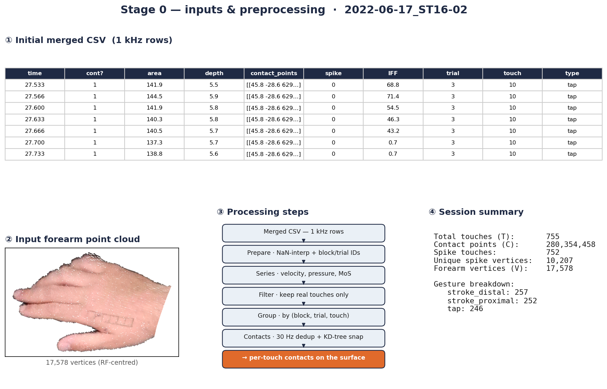

*The Stage-0 inputs for ST16-02. ① A snapshot of the initial merged CSV — one row per
1 kHz sample (contact area/depth, the raw `contact_points` string, spike, IFF, and the
block/trial/touch IDs). ② The input forearm point cloud (17 578 RF-centred vertices, with
the participant's skin colour). ③ The preprocessing steps as a flow. ④ Session summary:
755 touches (≈ 250 each of `stroke_proximal`, `stroke_distal`, `tap`), 280 M contact
points, 752 spike-eliciting touches, ~10 200 vertices ever touched during a spike.*

**Unwrapping the surface (SLIM UV).** The forearm is curved, so measuring area and
drawing a boundary is easier on a flat map. `run_slim_pipeline_core`
([`surface/forearm_slim_uv.py:95`](../../src/analysis/receptive_field_mapping/surface/forearm_slim_uv.py))
builds a mesh from the point cloud, cleans it, and applies a **SLIM** conformal flattening
to assign every vertex a 2-D `(U, V)` coordinate. The IFF-weighted centroid of all touches
becomes the origin, so the responsive region sits near `(0, 0)`. This is cached once per
session as `<session>_slim_uv.npz`.

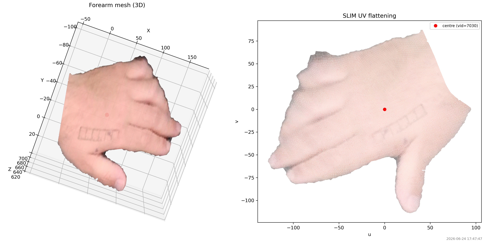

*Left: the 3-D forearm mesh. Right: the same mesh flattened to the 2-D UV plane. Every
later figure lives in this UV space.*

---

## Stage 1 — Reducing a single touch

A single touch is a short window during which the experimenter strokes or taps one spot.
`_compute_touch_rf`
([`pipelines/rf_single_touch_pipeline.py:38`](../../src/analysis/receptive_field_mapping/pipelines/rf_single_touch_pipeline.py))
reduces it to a **sparse per-vertex map**: for each frame it adds the IFF at the touched
vertices (`np.add.at` for the running mean, `np.maximum.at` for the max), divides by the
summed contact weight, and drops vertices where the neuron signal was NaN. Every touch becomes
a short list of `(vertex_index, mean_IFF)` pairs, stored in `single_touch_rf_maps_mean.npz`
(and `_max.npz`).

Each contact point's credit is scaled by **how deeply the skin was indented there**, relative to
the deepest point of that same frame, raised to `depth_weight_alpha`
(`tasks.spatial_map_single_touch.options.depth_weight_alpha`). The mean is weighted; the max is
not, because a weighted maximum has no meaning. At `alpha = 0` every weight is `1.0` and the
divisor is the plain contact count, which is the unweighted map. Both `.npz` files also carry
`rf_weight_sum` and Kish `rf_n_eff` per vertex — a confidence channel for display code, which
never alters the estimate.

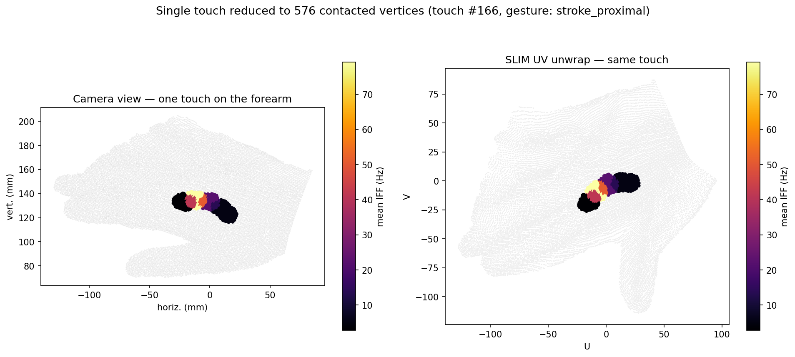

*One representative proximal stroke (touch #166) reduced to 576 contacted vertices,
coloured by mean IFF. Left: on the forearm; right: on the UV unwrap. The stroke paints a
compact patch with a clear hot spot (~75 Hz) fading to the edges — the neuron fired
hardest as the finger crossed its most sensitive skin. A tap would paint a smaller blob;
a distal stroke, a patch shifted along the arm.*

### Inside one touch, frame by frame

Touch #166 lasts 199 ms = **200 frames at 1 kHz**, but the contact only updates at ~30 Hz,
so there are **6 distinct contact frames**. Watching them in order is the whole idea of a
receptive field in miniature: the fingertip sweeps proximally, and the neuron's firing rate
rises and falls depending on *where* the contact is.

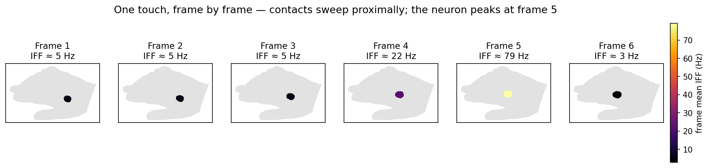

*The six contact frames, coloured by the neuron's IFF during each. Frames 1–3 sit at ~5 Hz,
frame 4 climbs to 22 Hz, frame 5 spikes to **79 Hz**, frame 6 drops to 3 Hz. The neuron
responds strongly only when the finger crosses one particular patch of skin — that patch is
the receptive field.*

The reduction (`_compute_touch_rf`, mean branch) is then just bookkeeping over those frames:
each contacted vertex accumulates `w · IFF` over every frame that touches it, sums the weights,
and divides.

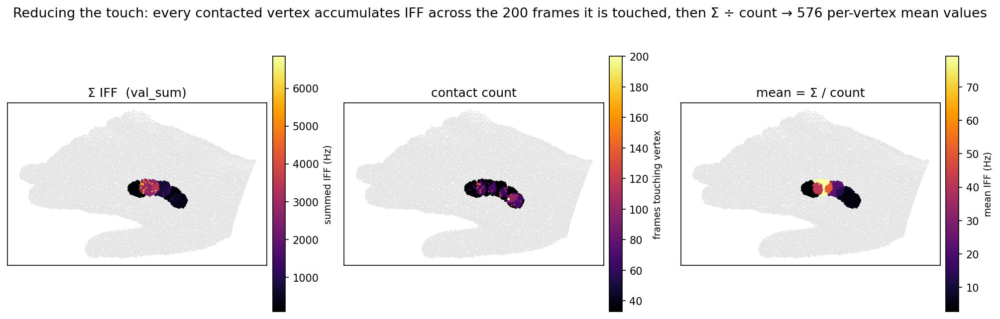

*Left: `Σ w·IFF` per vertex. Middle: `Σ w` — evidence, not a frame count (it reduces to the frame
count at `alpha = 0`). Right: `mean = Σ w·IFF / Σ w` — the 576-value sparse map (the same one shown
above). The bright core is where the high-IFF frame 5 landed.*

### This touch's attributes

Every touch also carries the stimulus and kinematic context that the series stage computed —
useful when relating RF responses to *how* the skin was touched.

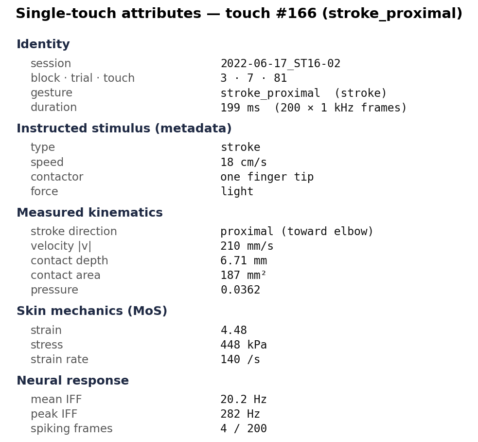

*Touch #166 at a glance: an instructed light, one-finger-tip proximal stroke at 18 cm/s;
measured ~210 mm/s, 6.7 mm indentation, 187 mm² contact, ~448 kPa skin stress; the neuron
averaged 20 Hz (peak 282 Hz) over the touch.*

---

## Stage 2 — Aggregating touches

One touch is noisy and only samples wherever the finger happened to land. The RF emerges
by **averaging across all touches**. `compute_rf_heatmap`
([`data/rf_population_heatmap.py:9`](../../src/analysis/receptive_field_mapping/data/rf_population_heatmap.py))
sums each vertex's per-touch IFF values and divides by how many touches hit it, giving one
value per vertex. Two clean-ups follow:

- **Overlap threshold** (`apply_vertex_threshold`) — drop vertices touched by fewer than
  **25 %** of touches, so a single stray touch can't invent signal at the fringe.
- **Island cleanup** (`clean_heatmap_islands`) — keep only the connected blob containing
  the global peak.

`run_population_response_field_extraction`
([`pipelines/rf_population_response_field_pipeline.py:99`](../../src/analysis/receptive_field_mapping/pipelines/rf_population_response_field_pipeline.py))
then **PCA-aligns** the map (so the RF's long axis is horizontal and sessions are
comparable) and interpolates the scattered vertex values onto a smooth **150 × 150 grid**
(`compute_interpolated_grid`, igl harmonic fill + cubic interpolation). This grid, `grid_z`,
is the aggregate RF heatmap.

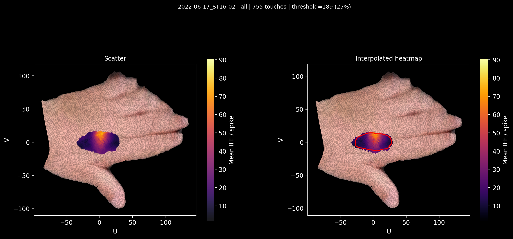

*ST16-02 aggregated over all 755 touches (25 % overlap threshold = 189 touches). Left:
per-vertex averages scattered on the forearm skin; right: the interpolated `grid_z`
heatmap with the fitted RF boundary (red) and centroid (+). This is the neuron's response
field — brighter = higher mean IFF.*

---

## Stage 3 — Defining the RF boundary

The heatmap is continuous; the receptive field needs an actual outline. The pipeline's
active method is the **radial "foot of the mountain"** boundary, `compute_radial_foot_boundary`
([`metrics/rf_radial_foot_boundary.py:554`](../../src/analysis/receptive_field_mapping/metrics/rf_radial_foot_boundary.py)).
Think of the heatmap as a hill: the boundary is where the hillside flattens out into the
surrounding plain. Concretely, it computes the largest Hessian eigenvalue (λmax) field,
casts rays outward from the peak, and on each ray takes the first point where the surface
turns concave-up (the base of the slope). The star-shaped curve is then clipped to the
actually-touched footprint so it can't bulge into skin no touch ever reached.

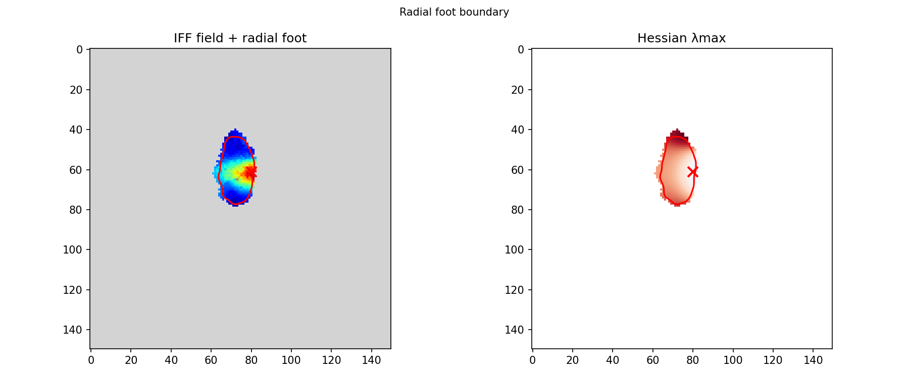

*Left: the interpolated IFF field (grid space) with the red radial-foot contour and the
peak (×). Right: the Hessian λmax field the rays are traced on. The contour hugs the base
of the responsive dome.*

From the closed contour the pipeline derives the RF metrics: **area** (mapped back to real
mm² via `uv_points_to_xyz`), perimeter, circularity, centroid, peak, and a PCA **ellipse**
(major/minor axis, orientation) via `compute_contour_pca`. All of this is saved to
`<session>_population_response_fields.npz`.

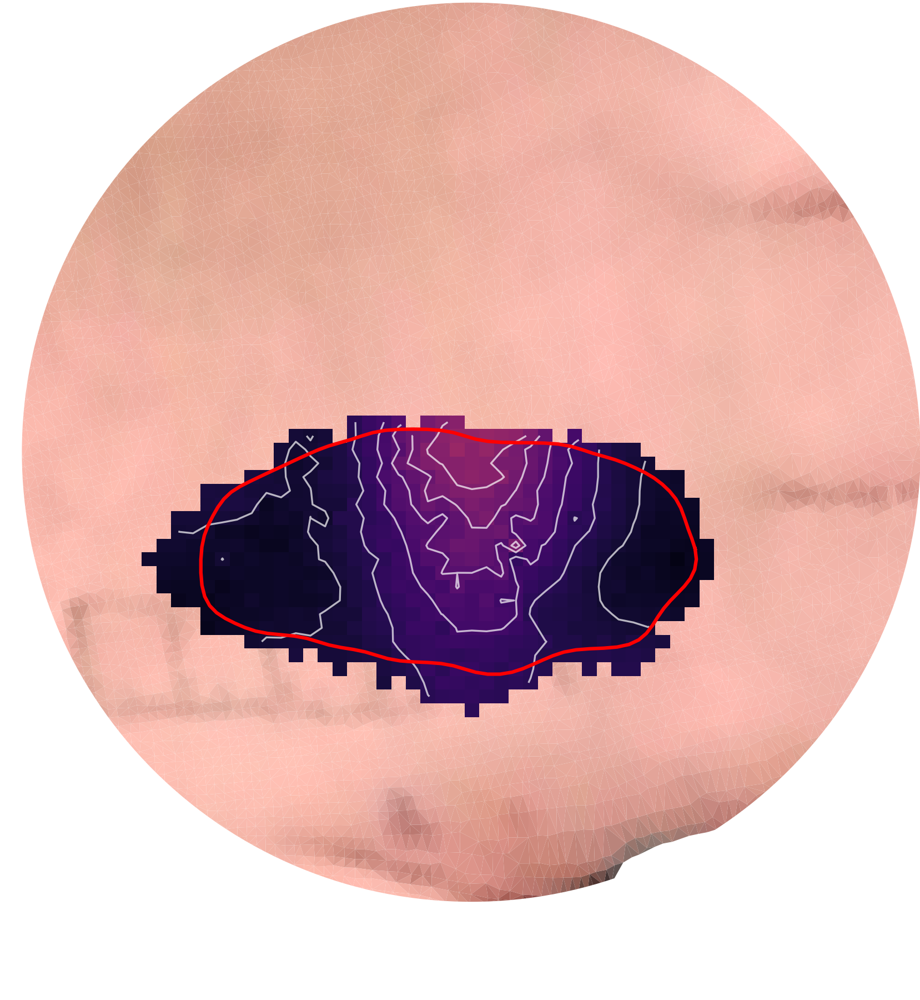

*The final receptive field for ST16-02: the red outline on the interpolated heatmap
(cropped, on the skin texture), with iso-IFF contour lines inside.*

### In depth: the Hessian λmax field

The boundary rests on one idea from differential geometry: the **Hessian** is the 2×2 matrix
of second derivatives of the surface, and its eigenvalues are the surface's two *principal
curvatures*. `_compute_hessian_lmax`
([`metrics/rf_radial_foot_boundary.py:148`](../../src/analysis/receptive_field_mapping/metrics/rf_radial_foot_boundary.py))
keeps **λmax**, the larger of the two, built in four steps:

1. **NaN-aware Gaussian smoothing** of `grid_z` at `gauss_sigma = 8` (normalised convolution —
   `compute_laplacian_arrays`, so NaN cells don't bleed into the edges).
2. **Nearest-neighbour extrapolation** of the smoothed field into the NaN surround, so the
   Hessian kernel has valid values to differentiate near the footprint edge.
3. **Hessian at `hess_sigma = 5`** (`skimage.hessian_matrix` with Gaussian derivatives),
   then its eigenvalues (`hessian_matrix_eigvals`, sorted descending → keep `eigs[0]`).
4. **Re-mask** λmax to NaN wherever `grid_z` was NaN.

On a soft bump λmax is **negative over the concave-down cap** (the dome curves downward in
every direction) and turns **positive at the concave-up foot** where the hillside meets the
flat surround. That sign flip — not a fixed IFF threshold — is what defines the RF edge, so
the boundary adapts to each neuron's dome shape.

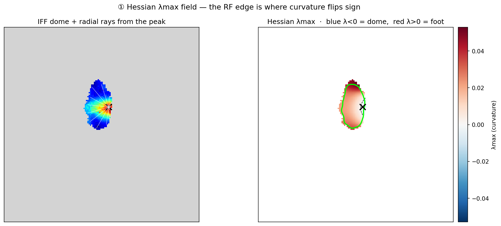

*Left: the IFF dome with the radial rays cast from the peak. Right: the λmax field
(diverging colours; dashed line = λmax 0). Blue (λ<0) is the dome cap; the red ring (λ>0) is
the foot. The green contour tracks that positive ring.*

### In depth: contour selection

The contour is chosen in two passes.

**Pass 1 — radial plateau profiling** (`_extract_radial_plateau_foot`,
[`:197`](../../src/analysis/receptive_field_mapping/metrics/rf_radial_foot_boundary.py)).
`n_angles = 360` rays are cast from the peak. Along each ray, λmax is sampled outward and
`scipy.signal.find_peaks` finds the **first plateau whose peak is positive** — its centre is
that ray's foot radius (the *natural* foot). To stop the smoothed λmax halo from placing the
foot on a cell no touch reached, each ray is also **snapped** back to its last valid raw
`grid_z` sample. The 360 radii are then circularly Savitzky-Golay smoothed
(`savgol_window = 31`).

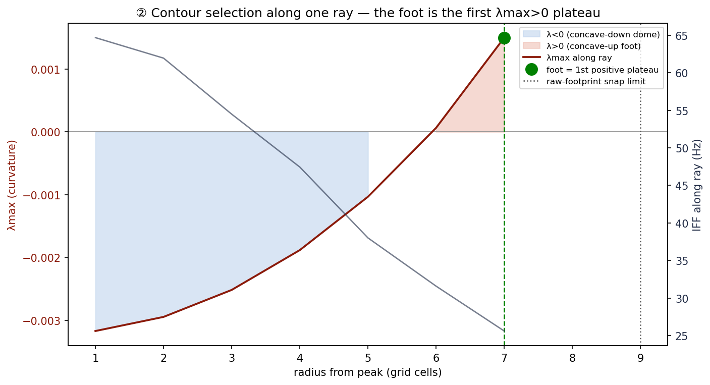

*λmax along one ray (dark red) vs the IFF (grey). λmax rises out of the concave-down dome
(blue), crosses zero, and the first positive plateau (green) is the foot; the dotted line is
the raw-footprint snap limit that would clip it if it sat further out.*

**Pass 2 — footprint envelope** (`envelope_contour_to_footprint`,
[`:374`](../../src/analysis/receptive_field_mapping/metrics/rf_radial_foot_boundary.py)).
The radial curve has exactly one radius per angle, so its straight chords bulge into
non-painted cells wherever the footprint is concave or split. This pass fixes that using
only the 2-D footprint: rasterise the polygon, intersect with `grid_z > 0`, keep the
connected component containing the peak, and re-trace its outer boundary (a light circular
Gaussian smooth, `envelope_smooth_sigma = 1.5`, takes the marching-squares staircase off).
The result never spills into skin no touch reached. Every step is fail-fast — a degenerate
ray field or an empty intersection raises, and the orchestrator returns `None` rather than
inventing a ring.

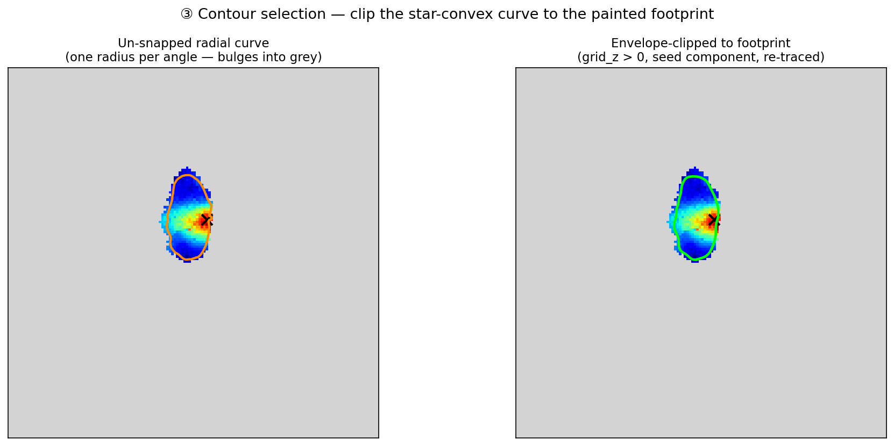

*Left: the un-snapped star-convex radial curve (orange) overshooting into grey. Right: the
final contour (green) after clipping to the painted footprint.*

> **Other boundary methods.** Two alternatives return the same metric set and can be
> selected via `boundary_method` in the DAG config:
> **gradient-ridge** ([`metrics/rf_gradient_boundary.py`](../../src/analysis/receptive_field_mapping/metrics/rf_gradient_boundary.py)) —
> the ring of steepest slope, tighter than the foot;
> **inflection** ([`metrics/rf_inflection_boundary.py`](../../src/analysis/receptive_field_mapping/metrics/rf_inflection_boundary.py)) —
> the Laplacian zero-crossing where the surface curvature flips sign.

---

## Stage 4 — RF profiles (downstream)

A final downstream task, `run_rf_profile_extraction`
([`pipelines/rf_profile_extraction_pipeline.py`](../../src/analysis/receptive_field_mapping/pipelines/rf_profile_extraction_pipeline.py)),
takes 1-D cross-sections through the RF centroid to characterise its shape and edges.

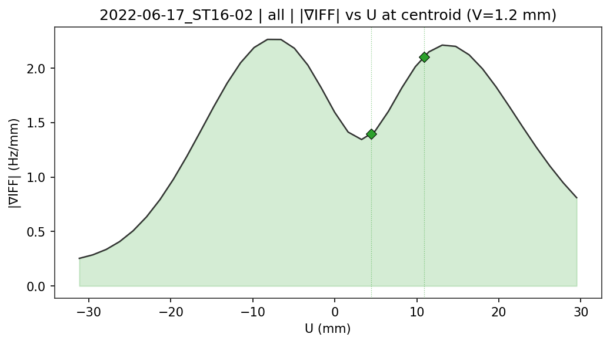

*Gradient magnitude |∇IFF| sampled along the U axis through the centroid. The two peaks
are the sharp edges of the RF on either side of the low-slope centre; green diamonds mark
where the boundary crosses the axis.*

---

## Where this runs

The stages map onto DAG tasks in
[`configs/analyse_workflow_processing_dag.yaml`](../../configs/analyse_workflow_processing_dag.yaml),
chained by dependency:

```
touch_prepare_sessions ─┐
touch_compute_series ───┤
                        ▼
spatial_map_single_touch          (Stage 1 — single_touch_rf_maps_*.npz)
                        ▼
spatial_precompute_slim_uv        (Stage 0 — <session>_slim_uv.npz)
                        ▼
spatial_extract_boundaries        (Stages 2 & 3 — population_response_fields.npz + PNGs)
                        ▼
spatial_extract_rf_profiles       (Stage 4 — 1-D profiles)
```

Key options on `spatial_extract_boundaries`: `iff_metric: mean`, `min_overlap_pct: 25`,
`boundary_method: radial`, `flip_u: true`. Run the whole processing workflow with
`python scripts/analysis_workflow_processing.py` (or via the GUI runner).

### Regenerating the figures

The figures in this walkthrough are curated from the pipeline's own PNG outputs plus two
generated panels (raw input, single touch). Rebuild them after re-running the pipeline:

```bash
conda activate social-touch-analysis
python scripts/generate_rf_workflow_doc_figures.py      # stage figures 01–07
python scripts/generate_rf_single_touch_detail.py --depth-weight-alpha 1.0   # Stage-1 deep dive 03a–03c
python scripts/generate_rf_boundary_detail.py           # Stage-3 deep dive 05a–05c
```

The scripts read the analysed outputs for `2022-06-17_ST16-02` under the project data
root and write `docs/receptive_field_workflow/figures/*.png`. They fail loudly if any
expected source artifact is missing. Pass `--depth-weight-alpha` the same value as
`tasks.spatial_map_single_touch.options.depth_weight_alpha` in
`configs/analyse_workflow_processing_dag.yaml`: the deep-dive script calls the pipeline's
own `_compute_touch_rf`, so a different alpha would draw a map the saved `.npz` does not
contain. It is required precisely so that value is never assumed. To rebuild the slide deck
(`rf_workflow_walkthrough.pptx`) from the figures, run
`python scripts/generate_rf_workflow_pptx.py`.
