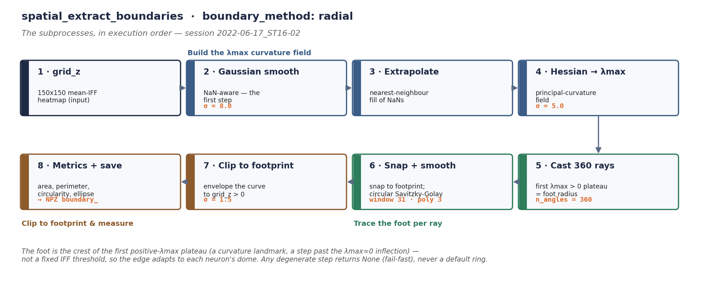
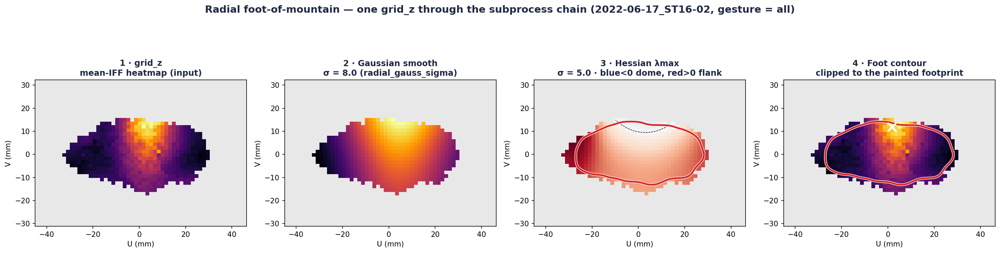
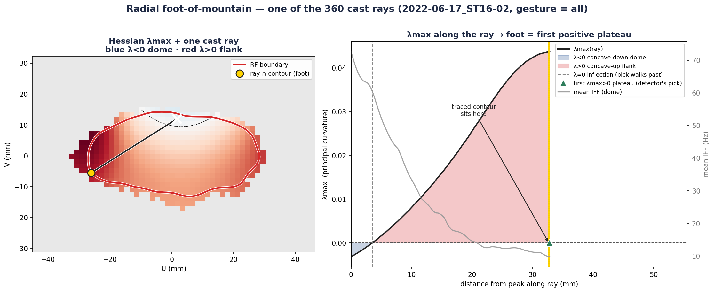
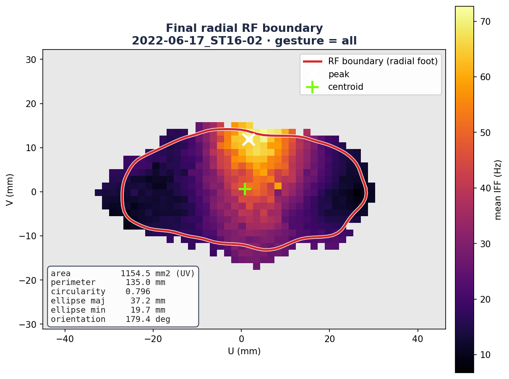

# Extracting the RF boundary — the radial "foot of mountain" workflow

This document describes the **`spatial_extract_boundaries`** step of the receptive-field
(RF) mapping pipeline: how it turns an aggregated IFF heatmap into a closed **RF boundary
contour**, walked through **in the order the subprocesses actually run**, with the **actual
parameter values** from the checked-in DAG config.

The pipeline is configured to run the **radial "foot of mountain"** method
(`boundary_method: radial`), so this document covers **only that method** — the one that
executes. For the end-to-end pipeline narrative (preprocessing → single touch → aggregation
→ boundary), see the broader
[receptive-field walkthrough](../receptive_field_workflow/README.md).

- **DAG task:** `spatial_extract_boundaries`
- **Entry point:** `run_population_response_field_extraction`
  ([`pipelines/rf_population_response_field_pipeline.py:99`](../../src/analysis/receptive_field_mapping/pipelines/rf_population_response_field_pipeline.py))
- **Boundary method:** `compute_radial_foot_boundary`
  ([`metrics/rf_radial_foot_boundary.py:554`](../../src/analysis/receptive_field_mapping/metrics/rf_radial_foot_boundary.py))
- **Config:** [`configs/analyse_workflow_processing_dag.yaml`](../../configs/analyse_workflow_processing_dag.yaml) (task `spatial_extract_boundaries`)

All figures below are generated by
[`scripts/generate_boundary_workflow_figures.py`](../../scripts/generate_boundary_workflow_figures.py)
from the worked example **`2022-06-17_ST16-02` (ST16-02)**, gesture `all` — see
[Regenerating the figures](#regenerating-the-figures).

---

## 1 · The input: building `grid_z`

The boundary detector consumes one 2-D field, **`grid_z`** — a **150 × 150 IFF heatmap on
the flattened forearm surface**. It is produced upstream (same task, earlier in the flow),
in this order:

1. **Per-vertex mean IFF** across all of the gesture's touches on the 3-D forearm mesh
   (`compute_rf_heatmap`), using `iff_metric: mean`; uncontacted vertices are `NaN`.
2. **Coverage threshold** — vertices touched by fewer than `min_overlap_pct` **= 25 %** of
   touches are excluded (`apply_vertex_threshold`), so one stray touch cannot invent a fringe.
3. **SLIM UV flattening** — the curved forearm mesh is unwrapped to a flat `(U, V)` plane via
   **SLIM**, then **PCA-aligned** so the RF long axis is horizontal (`compute_rf_pca_alignment`
   + `apply_uv_alignment`); `flip_u: true` negates the U axis.
4. **Harmonic interpolation onto the regular grid** — scattered per-vertex values are diffused
   across the mesh (`igl.harmonic`, solving ∇²z = 0) and sampled onto the **150 × 150** grid
   (`compute_interpolated_grid`); `median_filter_size: null` (disabled).
5. **Island cleanup** — only the connected blob containing the global peak is kept
   (`clean_heatmap_islands`), giving the final `grid_z`.

The result, `grid_z`, is `NaN` outside the touched footprint.

> **Coordinate note.** Internally the method works in **grid space** (row `r`, column `c`),
> then maps the contour back to **UV millimetres** for storage and rendering. The figures
> here are in UV space.

---

## 2 · The subprocess workflow

The radial "foot of mountain" method treats the heatmap as a **hill** (a "response dome")
and locates its **foot** — the ring where the hillside settles into the surrounding plain —
using the **largest eigenvalue of the Hessian** (λmax, the surface's larger principal
curvature). The edge is a **curvature landmark of λmax** — the crest of the concave-up
ridge, a step past the λmax = 0 inflection — not a fixed IFF threshold, so the boundary
adapts to each neuron's dome shape.

`compute_radial_foot_boundary` runs the following subprocesses **in order** (`None` is
returned at any degenerate step — fail-fast, never a default ring):



*The subprocesses in execution order, with the actual σ values annotated at each step.*

**0 · Guards.** Return `None` if `grid_z` is all-`NaN`, if no peak is found, or if the peak
lies within 2 px of the border.

**Build the λmax curvature field** (`_compute_hessian_lmax`,
[`:148`](../../src/analysis/receptive_field_mapping/metrics/rf_radial_foot_boundary.py)):

1. **Gaussian smoothing — first.** NaN-aware Gaussian smoothing of `grid_z` at
   **σ = `radial_gauss_sigma` = 8.0** (`compute_laplacian_arrays`, normalised convolution so
   `NaN` surround does not bleed into the edges). *Yes — the field is smoothed first, with a
   Gaussian, at σ = 8.0.*
2. **Extrapolate** the smoothed field into the `NaN` surround by nearest-neighbour
   (`distance_transform_edt`), so the Hessian kernel has valid values at the footprint edge.
3. **Hessian → λmax** at **σ = `radial_hess_sigma` = 5.0** (`skimage.hessian_matrix` with
   Gaussian derivatives); eigenvalues sorted descending → keep the larger, **λmax**.
4. **Re-mask** λmax to `NaN` wherever `grid_z` was `NaN`.

On a soft bump, **λmax < 0 over the concave-down cap** and turns **positive on the
concave-up flank**; it then peaks (crests) a step further out, where the hillside settles
into the plain — and that **crest**, not the λmax = 0 crossing, is the foot the detector
traces.

**Trace the foot per ray** (`_extract_radial_plateau_foot`,
[`:197`](../../src/analysis/receptive_field_mapping/metrics/rf_radial_foot_boundary.py)):

5. **Cast `n_angles` = 360 rays** from the peak. Along each, sample λmax outward and use
   `scipy.signal.find_peaks` to find the **first plateau whose peak is positive** — its
   **centre** is that ray's foot radius:
   `r_foot(θ) = (left_edge + right_edge) // 2` of the first λmax > 0 plateau. This crest sits
   **outside** the λmax = 0 inflection (the steepest-slope point the ray crossed first).
6. **Snap + smooth.** Each ray is **snapped** back to its last valid raw `grid_z` sample so
   the foot can never land on a `NaN` cell; the 360 radii are then circularly
   **Savitzky-Golay** smoothed (window 31, polyorder 3).

**Clip to the footprint & measure:**

7. **Footprint envelope** (`envelope_contour_to_footprint`,
   [`:374`](../../src/analysis/receptive_field_mapping/metrics/rf_radial_foot_boundary.py)).
   The star-convex radial curve (one radius per angle) can bulge into non-painted cells where
   the footprint is concave or split. This pass rasterises the polygon, intersects it with
   `footprint = grid_z > 0`, keeps the **peak-connected component** (`scipy.ndimage.label`),
   and re-traces its outer boundary (marching squares), with a light circular Gaussian smooth
   at **σ = `radial_envelope_smooth_sigma` = 1.5** to remove the staircase.
8. **Metrics + save** — the closed contour feeds the metric machinery (§4) and is written to
   the output NPZ.



*The field progression: **1** the input `grid_z`; **2** Gaussian-smoothed (σ = 8);
**3** the Hessian **λmax** field (σ = 5) — blue (λ < 0) is the concave-down dome cap, the
red region (λ > 0) is the concave-up flank, dashed line = λmax 0 (the inflection), red
contour = the traced foot (crest of the first positive-λmax plateau); **4** the final foot
contour clipped to the painted footprint.*

### The Hessian curvature field — from smoothed field to λmax

Let **`g`** be the smoothed IFF surface — `grid_z` after the σ = 8.0 NaN-aware Gaussian
(step 1) and nearest-neighbour NaN-extrapolation (step 2). At each grid cell `(r, c)` the
detector forms the **2 × 2 Hessian** of second partial derivatives, each estimated by
convolution with a **Gaussian second-derivative kernel at σ = `radial_hess_sigma` = 5.0**
(`skimage.hessian_matrix`, `order="rc"`, `use_gaussian_derivatives=True`):

```
H(r,c) = ⎡ g_rr  g_rc ⎤
         ⎣ g_rc  g_cc ⎦
```

Its two eigenvalues are the **principal curvatures** of the surface — the sharpest and the
gentlest bending at that cell. In closed form:

```
λmax, λmin = (g_rr + g_cc)/2  ±  sqrt( ((g_rr − g_cc)/2)² + g_rc² )
```

The `+` root is **λmax**. Equivalently, since `g_rr + g_cc` is the **trace** (the Laplacian)
and `g_rr·g_cc − g_rc²` is the **determinant**, `λmax = trace/2 + sqrt((trace/2)² − det)`.
`skimage.hessian_matrix_eigvals` returns the pair **sorted descending**, so the code keeps
`eigs[0]` = λmax (`_hessian_eigvals`,
[`:133`](../../src/analysis/receptive_field_mapping/metrics/rf_radial_foot_boundary.py)),
then re-masks it to `NaN` wherever `grid_z` was `NaN`.

**Sign convention → what the foot is.** A response dome is concave-down: near the peak both
principal curvatures are negative, so **λmax < 0** (blue). Moving outward down the hillside
the surface rolls over to **concave-up** as it flattens into the plain — the radial
curvature turns positive, so **λmax > 0** (red). The **λmax = 0 crossing** is the
*inflection* — the point of steepest slope, where the concave-up flank begins — but it is
**not** the boundary. The detector walks a step further out to the **crest of that concave-up
ridge** (the first positive-λmax plateau, step 5), where the surface dishes upward most
strongly: that crest is the *foot of the mountain*, where the hillside settles into the
plain. Because the foot is a curvature **landmark of shape** rather than a fixed IFF level,
the same rule fits a tall sharp dome and a low broad one.

### Worked example — one of the 360 rays

Step 5 casts **360 rays** from the peak and, on each, reads λmax outward until the **first
plateau whose peak is positive** (`scipy.signal.find_peaks`, `require_positive`); that
plateau's **centre** — the crest of the concave-up ridge, a step past the λmax = 0
inflection — is the ray's foot radius. Tracing a single representative ray makes the 1-D
logic behind the 2-D contour visible:



*Left: the Hessian **λmax** heatmap (blue λ < 0, red λ > 0, dashed = λmax 0) with one ray
cast from the peak (×); the red curve is the final RF boundary and the yellow dot is where
this ray meets it. Right: **λmax sampled along that ray vs. radius from the peak** — negative
(blue fill, concave-down dome cap) near the peak, crossing zero and turning positive (red
fill, concave-up flank) down the hillside. The green triangle is the detector's pick — the
**crest of the first λmax > 0 plateau**, a step past the zero-crossing — and the yellow line
is where the traced contour sits; the two coincide. The grey curve is the IFF dome profile
(right axis), flattening out toward the plain as λmax crests.*

---

## 3 · Parameter values

Current checked-in values, `configs/analyse_workflow_processing_dag.yaml`, task
`spatial_extract_boundaries`:

```yaml
spatial_extract_boundaries:
  options:
    force_processing: false
    neuron_mode: iff
    iff_metric: mean                 # §1.1 which IFF statistic builds the heatmap
    min_overlap_pct: 25              # §1.2 coverage threshold
    median_filter_size:              # §1.4 null = disabled
    heatmap_space: linear
    cmap: inferno
    flip_u: true                     # §1.3 negate the U axis after PCA alignment
    contour_color: red
    circular_crop_margin: 0.0
    boundary_method: radial          # selects the foot-of-mountain method (§2)
    radial_gauss_sigma: 8.0          # step 2.1 Gaussian pre-smooth σ
    radial_hess_sigma: 5.0           # step 2.3 Hessian derivative-kernel σ
    radial_envelope_smooth_sigma: 1.5  # step 2.7 footprint-envelope smooth σ
  depends_on: [spatial_map_single_touch, spatial_precompute_slim_uv]
```

| Key | Value | Consumed by |
|-----|-------|-------------|
| `iff_metric` | `mean` | §1.1 per-vertex heatmap |
| `min_overlap_pct` | `25` | §1.2 coverage threshold |
| `median_filter_size` | *null* | §1.4 grid interpolation (disabled) |
| `flip_u` | `true` | §1.3 UV alignment |
| `boundary_method` | `radial` | selects §2 |
| `radial_gauss_sigma` | `8.0` | step 2.1 Gaussian pre-smooth |
| `radial_hess_sigma` | `5.0` | step 2.3 Hessian kernel |
| `radial_envelope_smooth_sigma` | `1.5` | step 2.7 envelope smooth |

> **Note.** `inflection_sigma: 5.0` is present in the config but is **not consumed by the
> radial path** — it only drives side-computed comparison markers. Setting
> `inflection_sigma: null` disables boundary computation entirely.

---

## 4 · Boundary metrics

The closed contour feeds the shared metric machinery
([`rf_inflection_boundary.py`](../../src/analysis/receptive_field_mapping/metrics/rf_inflection_boundary.py)):

| Metric | Formula / function |
|--------|--------------------|
| **Area** | shoelace polygon area in **UV mm²** (`compute_polygon_area`) — the SLIM UV plane is mm-scaled, so this approximates physical skin area |
| **Perimeter** | summed segment lengths in UV mm (`compute_polygon_perimeter`) |
| **Centroid** | polygon centroid (`compute_polygon_centroid`) |
| **Circularity** | `4·π·area / perimeter²` |
| **PCA ellipse** | major/minor axis + orientation (`compute_contour_pca`) |



*The final receptive field for ST16-02 (peak ×, centroid +), with the derived metrics
annotated.*

The contour and metrics are written to `<session>_population_response_fields.npz` under the
`boundary_` prefix (`boundary_contour_uv_<gtype>`, `boundary_centroid_uv_<gtype>`,
`boundary_peak_uv_<gtype>`, …), along with a `boundary_method` key recording which method
produced them.

The downstream task **`spatial_extract_rf_profiles`**
([`rf_profile_extraction_pipeline.py`](../../src/analysis/receptive_field_mapping/pipelines/rf_profile_extraction_pipeline.py))
reads the active `boundary_contour_uv_<gtype>` and reports where it crosses each 1-D
cross-section, via linear interpolation of contour segments against a scanline:

```
u_cross = u1 + (v_target − v1) · (u2 − u1) / (v2 − v1)
```

---

## 5 · Where this runs

```
spatial_map_single_touch ─┐
spatial_precompute_slim_uv ┤
                           ▼
spatial_extract_boundaries        ← this document (grid_z → radial boundary + metrics)
                           ▼
spatial_extract_rf_profiles       (consumes the active boundary contour)
spatial_compare_boundaries        (downstream comparisons)
```

Run the whole processing workflow with `python scripts/analysis_workflow_processing.py`, or
launch the GUI runner and pick `spatial_extract_boundaries`.

### Regenerating the figures

```bash
conda activate social-touch-analysis
python scripts/generate_boundary_workflow_figures.py
```

The script loads the analysed `<session>_population_response_fields.npz` for
`2022-06-17_ST16-02`, recomputes the radial boundary on the same `grid_z` with the
checked-in DAG parameters, and writes
`docs/spatial_extract_boundaries/figures/bd_0{1,2,3}_*.png`. It fails loudly if the NPZ is
missing (run `spatial_extract_boundaries` first). To rebuild the slide deck
(`spatial_extract_boundaries.pptx`), run `python scripts/generate_boundary_workflow_pptx.py`.
